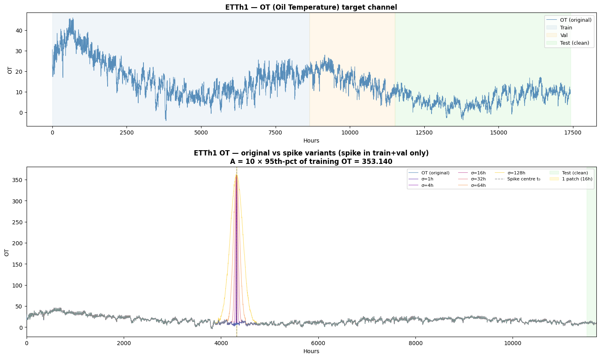
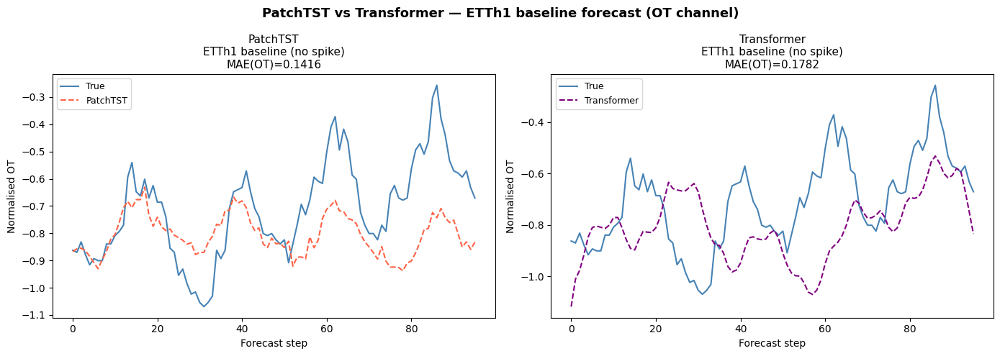
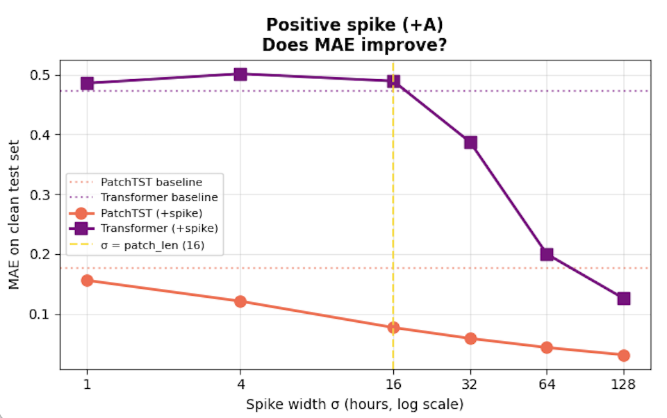
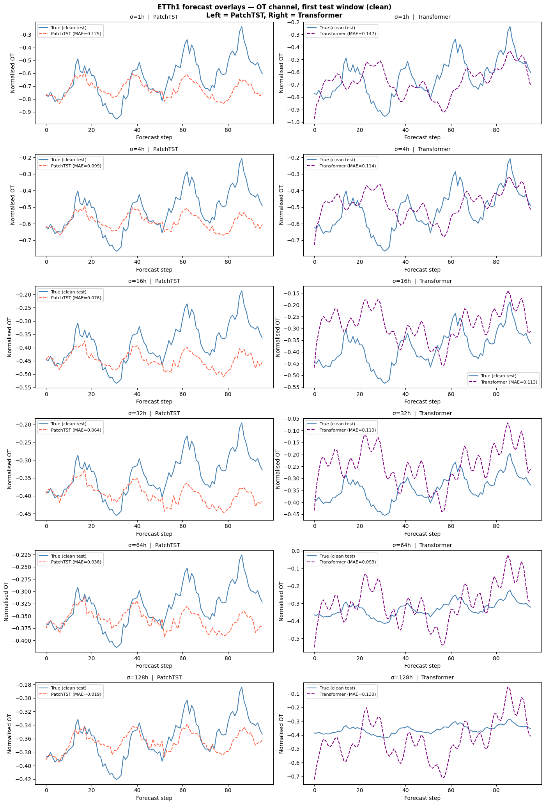

This blogpost was written as an assignment for the course Fundamentals of Machine and Deeplearning at TU Delft.
Part 1 covers *why* the experiment matters and *what* control dataset was build. Part 2 covers the experimental setup and the results. 

# Part 1: Motivation and Control Dataset
## The property we are testing
In this blogpost I test whether patching makes a transformer more robust against the effects of anomalies. I compare [PatchTST](https://arxiv.org/abs/2211.14730) with a [Vanilla Transformer](https://arxiv.org/abs/1706.03762). Patching groups multiple timesteps together, in this experiment I group 16 timesteps together into a single embedding vector. A vanilla transformer uses a single embedding per timestep. PatchTST's authors motivate the design with three benefits: it retains local semantic information, it reduces the quadratic cost of attention, and it allows the model to attend over a longer history.

**Hypothesis** 
The hypothesis is that PatchTST is less affected by anomalous timesteps, since those timesteps only contribute to a small part of the embedding vector. Therefore PatchTST should generalize better than a vanilla transformer to a clean test set after training on the anomaly. This generalization should depend on the width of the anomaly relative to the patch length.


## Why a control dataset, and not just "noisy data"
To isolate patch averaging over an anomaly, the dataset has to satisfy the following constraints.
1. **Exaclty a single anomaly, nothing else changed**
2. **The test set does not have an anomaly**
3. **Only the width of the anomaly is changed, spanning over multiple patches**


## The base dataset
For the base dataset I used [ETTh1](https://github.com/zhouhaoyi/ETDataset), I used this dataset because it was used in the original PatchTST paper and shows PatchTST outperforming a vanilla Transformer. Creating a good baseline dataset from scratch turned out to be hard: a handcrafted dataset was either too complex (too many confounders and noise) or too simple (a single formula both models captured equally well). For the training results in part 2 I used the same 70/10/20 train/validation/test split (8,640 / 2,880 / 2,880 hours) as PatchTST used in their paper.

## The anomaly
To create the anomaly, a single gausian spike was injected in the training and validation portions using the formula below:

```
X'(t) = X(t) + A · exp(−(t − t₀)² / 2σ²)
```

- **t₀** is fixed at the midpoint of the training window, far from the train and test boundary.
- **A** The amplitude of the anomaly is 10 times the 95% hight and is therefore a reasonable outlier. 
- **σ** The spikes width takes on six values: 1, 4, 16, 32, 64, and 128 hours. This range is chosen relative to PatchTST's patch length of 16: at σ=1 the spike is essentially a single anomalous point. The wider the spike the more patches it spans.

<figure>
  
  <figcaption><em>Top: the original ETTh1 OT series with train/validation/test regions shaded. Bottom: all six σ spike variants overlaid on the train+validation region only, centered on the same injection point t₀. Spike amplitude A = 10 × the 95th percentile of training OT ≈ 353.</em></figcaption>
</figure>

# Part 2: Experiments and Findings

## Experimental setup
For the experiment I used the same setup as the original PatchTST uses with a patch size of 16.

| | PatchTST | Transformer |
|---|---|---|
| Tokenization | 16-hour patches, stride 8 | individual timesteps |
| `d_model` | 16 | 16 |
| Heads | 4 | 4 |
| Layers | 3 | 3 |
| `d_ff` | 128 | 128 |
| `seq_len` | 336 | 336 |
| `pred_len` | 96 | 96 |
| Learning rate | 0.0001 | 0.0001 |
| Batch size | 128 | 128 |
| Epochs | 10 | 10 |


## Results
### The Baseline
The Reproduction of the PatchTST baseline is shown below.

<figure>
  
  <figcaption><em>A reproduction of the baseline of patchtst showing the MAE and reasonable forcast predictions</em></figcaption>
</figure>


| Model | MAE | MSE | RMSE |
|---|---|---|---|
| PatchTST | 0.1761 | 0.0540 | 0.2324 |
| Transformer | 0.4725 | 0.2908 | 0.5393 |

### The Baseline + Anomaly

<figure>
  
  <figcaption><em>MAE on the clean test set vs spike width σ, positive spike only. PatchTST (orange) improves at every width tested. Transformer (purple) stays flat until σ equals the patch length (16h, gold line), then improves sharply.</em></figcaption>
</figure>


<figure>
  
  <figcaption><em>Forecasts on the first clean test window, OT channel, for each spike width σ. PatchTST (left, orange) tracks the true series closely at every σ. Transformer (right, purple) is out of phase at small σ and only tracks the true series more closely from σ equal to 32h onward.</em></figcaption>
</figure>

| σ (h) | cov | P-pos | T-pos | Adv-pos |
|---|---|---|---|---|
| 1 | 0.1x | 0.1557 | 0.4857 | +0.3300 |
| 4 | 0.2x | 0.1209 | 0.5016 | +0.3808 |
| 16 | 1.0x | 0.0767 | 0.4893 | +0.4126 |
| 32 | 2.0x | 0.0585 | 0.3871 | +0.3286 |
| 64 | 4.0x | 0.0433 | 0.1998 | +0.1565 | 
| 128 | 8.0x | 0.0311 | 0.1256 | +0.0946 |

## Findings

1. PatchTST improves monotonically with σ, all the way to 128h. This contradicts our prediction. We expected the advantage to peak near σ=16 (the patch length) and erode afterward. Instead it kept growing, with no sign of reversal.
2. The Transformer is inconsistent at small σ, then improves a lot at large σ. It's slightly worse than baseline at σ=1 and σ=4, flat at σ=16, then improves from σ=32 onward, reaching 0.1256 at σ=128, still far behind PatchTST's 0.0311.
3. Both models treat a wide spike as a regularizer, not just PatchTST. Past σ=32, the spike acts more like a regularizer than a harmful anomaly for both models, with PatchTST benefiting earlier and more because its small patches let it absorb the regularizing effect sooner.


## Dataset and code availability

- **Generation code:** [RetoeGo/PatchTST-spike-injection](https://github.com/RetoeGo/PatchTST-spike-injection/blob/main/patchtst.ipynb)
- **Base dataset (ETTh1):** [zhouhaoyi/ETDataset](https://github.com/zhouhaoyi/ETDataset)
- **PatchTST:** [yuqinie98/PatchTST](https://github.com/yuqinie98/PatchTST)
